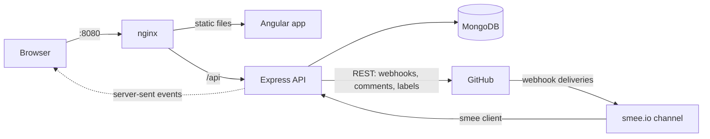

# Zap Runner

Zap Runner is a small workflow automation app in the spirit of Zapier: each Zap connects one trigger
to one action. Its core Zap is "GitHub pull request opened, then comment on that pull request", and
the same engine runs 10 GitHub triggers and 9 GitHub actions.

- [Features](#features)
- [Tech stack](#tech-stack)
- [Architecture](#architecture)
- [Running with Docker](#running-with-docker)
- [Running locally](#running-locally)
- [Tests and checks](#tests-and-checks)
- [Security](#security)
- [Decisions and trade-offs](#decisions-and-trade-offs)
- [Limitations](#limitations)

## Features

### Zaps

- **Sign in with GitHub.** OAuth sign-in; every Zap, run and setting belongs to the signed-in user
  and is invisible to anyone else.
- **Builder.** Name, trigger and action pickers grouped by category, typed settings (text,
  templates, repository picker, toggles, selects) and field mapping with `{{pr.title}}`-style
  placeholders. Fields are inserted with one click and a live preview renders the action with the
  latest real event, or with a built-in sample until one arrives.
- **Lifecycle.** Turn a Zap on (creates its GitHub webhook) or off (removes it), save unfinished
  work as a draft, duplicate a Zap as a new copy that starts off, and delete it.
- **Test run.** Resolves the Zap against the latest matching event, or a sample, and shows what the
  action would send without calling GitHub.
- **App picker.** GitHub is runnable; GitLab, Slack, Linear, Jira and Sentry are listed as coming
  soon.

### Triggers and actions

| Triggers                                      | Actions                                      |
| --------------------------------------------- | -------------------------------------------- |
| Pull request opened (optionally skip drafts)  | Comment on the pull request                  |
| Pull request merged                           | Add labels                                   |
| Pull request closed                           | Remove a label                               |
| Pull request reopened                         | Assign people                                |
| Pull request ready for review                 | Request reviewers                            |
| Pull request review requested                 | Close                                        |
| Pull request synchronize (new commits pushed) | Reopen                                       |
| Pull request labeled                          | Add a reaction (any of GitHub's 8)           |
| Pull request review submitted                 | Merge a pull request (merge, squash, rebase) |
| Pull request comment created                  |                                              |

Every action targets `{{repo.fullName}}` and `{{pr.number}}` by default, so it acts on the pull
request that fired the trigger.

### Runs

- **Live run history.** Per Zap and across all Zaps, updated live as events arrive. Filter by
  status (succeeded, failed, retrying, skipped) and by time range.
- **Run detail.** Each attempt with its outcome and duration, the resolved action settings, direct
  links to the pull request and to the comment posted, and the raw GitHub payload with syntax
  highlighting.
- **Retries.** Failures that GitHub marks as temporary (rate limits, 5xx) are retried with
  exponential backoff: 4 attempts, 2 s, 8 s and 32 s apart, capped at 60 s, with jitter.
- **Replay.** Any failed or skipped run can be sent through the Zap again.
- **Loop protection.** Comments posted by a Zap carry a hidden marker, so a "comment created"
  trigger never fires on a Zap's own comment.

### Copilot

Describe a Zap in a sentence, for example "When a pull request is opened on my playground repo,
thank the author". The Copilot drafts the Zap, asks a follow-up question when the repository is
ambiguous, and saves the result as a draft that opens in the builder. Nothing runs until you review
it and turn it on.

Each user picks a model provider and saves their own key under Settings:

| Provider      | Cost                             | Where to get a key                            |
| ------------- | -------------------------------- | --------------------------------------------- |
| Google Gemini | Free tier, no card, rate limited | <https://aistudio.google.com/apikey>          |
| OpenAI        | Paid, billed by usage            | <https://platform.openai.com/api-keys>        |
| Anthropic     | Paid, billed by usage            | <https://console.anthropic.com/settings/keys> |

Keys are verified with the provider, stored encrypted and only shown again as their last four
characters. The rest of the app works without any key.

### Feedback

Toasts confirm saves, on/off, delete, duplicate, replay, test runs and key changes. Failures with no
inline place are shown as error toasts, and form errors stay next to their field. An expired session
returns to the sign-in page, and a GitHub token that was revoked offers a one-click sign-in again.
Every list and page has a skeleton while loading and a real empty state.

## Tech stack

| Layer        | Technology                                                                                        |
| ------------ | ------------------------------------------------------------------------------------------------- |
| Language     | TypeScript 6 (strict), npm workspaces                                                             |
| Runtime      | Node.js 24                                                                                        |
| API          | Express 5, pino and pino-http logging, express-rate-limit                                         |
| Database     | MongoDB 8 with Mongoose 9                                                                         |
| GitHub       | GitHub OAuth App, `@octokit/rest` 22, repository webhooks                                         |
| Validation   | zod 4, shared by the API and the web app                                                          |
| Web          | Angular 22: standalone components, signals, zoneless change detection, typed reactive forms, RxJS |
| Live updates | Server-sent events                                                                                |
| Copilot      | Official Gemini, OpenAI and Anthropic SDKs, with structured JSON output                           |
| Testing      | Vitest 5, supertest, mongodb-memory-server                                                        |
| Code quality | ESLint 10 with typescript-eslint (strict type-checked) and angular-eslint, Prettier               |
| Delivery     | Docker, Docker Compose, nginx, smee.io webhook relay                                              |
| CI           | GitHub Actions                                                                                    |

## Architecture



### Repository layout

```
apps/api          Express API
apps/web          Angular app, served by nginx in Docker
packages/shared   zod contracts and the {{field}} template resolver used by both sides
```

### API modules (`apps/api/src`)

| Module          | Responsibility                                                           |
| --------------- | ------------------------------------------------------------------------ |
| `auth/`         | GitHub OAuth flow, sessions, the `authenticate` middleware               |
| `zaps/`         | Zap CRUD, on/off (webhook registration), duplicate, test runs            |
| `deliveries/`   | Webhook endpoint, signature check, run storage, the runner, retries, SSE |
| `integrations/` | The registry of apps, triggers and actions                               |
| `copilot/`      | Model providers, prompt, validation and the drafting flow                |
| `github/`       | Octokit client per user, repository listing                              |
| `http/`         | Error mapping, same-origin check, rate limits, health checks             |
| `platform/`     | Environment parsing, database, logger, encryption                        |

Routers never touch Mongoose models directly; they go through services and user-scoped
repositories, which is enforced by a lint rule. Everything that crosses a boundary (request bodies,
query strings, webhook payloads, environment, model output) is parsed with zod, and the web app
uses the same contracts from `packages/shared`.

### From webhook to run

1. Turning a Zap on creates a repository webhook on GitHub with its own random secret, stored
   encrypted. The webhook URL carries the Zap id.
2. GitHub posts the event to smee, and the smee client forwards it to `POST /webhooks/github`.
3. The API finds the Zap by `X-GitHub-Hook-ID`, verifies the HMAC signature on the raw body, then
   stores the delivery. A unique index on the Zap and GitHub's delivery id makes redelivery
   idempotent.
4. The runner asks the trigger whether the event matches, extracts its fields, resolves the action's
   templates and executes the action.
5. The result, each attempt and any retry schedule are stored on the run. Retries are claimed with
   an atomic lease in MongoDB, so they survive a restart.
6. Every change is pushed to open browsers over server-sent events.

### The registry

Triggers, actions and apps are registry entries, not branches in the engine. A trigger declares its
webhook event, settings, payload schema, output fields, sample and a `match` function. An action
declares its settings and an `execute` function.

Adding a trigger or action is one new file plus one line in
`apps/api/src/integrations/registry.ts`, with no engine or UI changes. The builder, preview, test run
and Copilot read everything from the registry. A new action looks like this:

```ts
export const addLabels = defineAction({
  id: 'github.add_labels',
  appId: 'github',
  group: 'Pull requests',
  name: 'Add labels',
  description: 'Adds labels to the pull request.',
  configFields: [
    { key: 'labels', label: 'Labels', kind: 'template', required: true },
    ...targetFields,
  ],
  config: z.object({ ...targetSchema, labels: listSchema }),

  async execute(settings, context) {
    const repository = repositoryOf(settings.repository);
    await context.github.rest.issues.addLabels({
      owner: repository.owner,
      repo: repository.name,
      issue_number: settings.number,
      labels: settings.labels,
    });
    return { ok: true, summary: `Added ${settings.labels.join(', ')}`, data: {} };
  },
});
```

The real file also turns GitHub errors into retryable or final failures with `githubFailure`. Pull
request event triggers come from `defineEventFamily`, which generates one trigger per webhook action.

## Running with Docker

Requirements: Docker with Compose, and a GitHub account.

1. Create a GitHub OAuth App at <https://github.com/settings/developers>:
   - Homepage URL: `http://localhost:8080`
   - Authorization callback URL: `http://localhost:8080/api/auth/github/callback`
2. Create a webhook relay channel at <https://smee.io/new> and copy its URL.
3. Copy the environment file and fill it in:

   ```sh
   cp .env.example .env
   ```

   | Variable               | Value                                                   |
   | ---------------------- | ------------------------------------------------------- |
   | `GITHUB_CLIENT_ID`     | From the OAuth App                                      |
   | `GITHUB_CLIENT_SECRET` | Generated on the OAuth App page                         |
   | `ENCRYPTION_KEY`       | Output of `openssl rand -base64 32`                     |
   | `WEBHOOK_PUBLIC_URL`   | The smee channel URL                                    |
   | `GITHUB_REPO_ACCESS`   | `public` (default) or `all` to use private repositories |

   Every other variable has a working default and is documented in `.env.example`.

4. Start everything:

   ```sh
   docker compose up --build
   ```

5. Open <http://localhost:8080>, sign in with GitHub, create a Zap on a repository you administer,
   turn it on and open a pull request there.

After editing `.env`, recreate the API so it picks up the change:
`docker compose up -d --force-recreate api`.

| Service | Purpose                                                              |
| ------- | -------------------------------------------------------------------- |
| `web`   | Angular app served by nginx on port 8080, proxying `/api` to the API |
| `api`   | Express API on port 3000 inside the network, health-checked          |
| `mongo` | MongoDB 8, exposed on 27017 for local development                    |
| `smee`  | Forwards GitHub webhook deliveries from the smee channel to the API  |

Health endpoints: `GET /api/health` (process is up) and `GET /api/ready` (database connected and
accepting work).

## Running locally

Requires Node.js 24 (`nvm use`) and the same `.env` as above, with two changes:

- `APP_URL=http://localhost:4200`
- add `http://localhost:4200/api/auth/github/callback` as the callback URL of the OAuth App (or use
  a second OAuth App for development)

```sh
npm install
docker compose up -d mongo
npm run dev:api
npm run dev:web
npx smee-client --url "$WEBHOOK_PUBLIC_URL" --target http://localhost:3000/webhooks/github
```

Run each long-running command in its own terminal. The API reloads on change and reads `.env` from
the repository root; the Angular dev server runs on <http://localhost:4200> and proxies `/api` to
port 3000. The last command replaces the `smee` container, which forwards to the API inside Docker.

## Tests and checks

| Command                | What it runs                                                               |
| ---------------------- | -------------------------------------------------------------------------- |
| `npm run typecheck`    | TypeScript for every workspace, including Angular templates                |
| `npm run lint`         | ESLint, strict type-checked, plus Angular template and accessibility rules |
| `npm run format:check` | Prettier check; `npm run format` rewrites the files                        |
| `npm test`             | Vitest for `packages/shared` and `apps/api`                                |

The test suite needs no running services: integration tests start an in-memory MongoDB with
mongodb-memory-server and drive the Express app with supertest. GitHub is replaced by a fake that
records every request. The suite covers:

- sign-in, sessions and isolation between users;
- the Zap lifecycle, webhook registration, drafts and duplication;
- webhook signatures, idempotency, loop protection, retries and replay;
- every trigger and action, the registry and the template resolver;
- the Copilot flow against a scripted model;
- error mapping and rate limits.

### Continuous integration

GitHub Actions runs on every push to `main` and on pull requests:

```
typecheck ─┐
lint ──────┤
format ────┼─> images ─> smoke
test ──────┘
```

- `typecheck`, `lint`, `format` and `test` run in parallel, one named check each.
- `images` builds the API and web Docker images once the checks pass.
- `smoke` starts those exact images with Docker Compose and a placeholder `.env`, then checks that
  the app is served, `/api/ready` answers through nginx, unauthenticated requests get 401 and
  sign-in redirects to GitHub with the configured client.

The workflow token is read-only, a newer push cancels an older run on the same branch, and every
job has a timeout.

## Security

- **GitHub scopes.** OAuth Apps cannot be limited to single repositories, so the app asks for the
  smallest set that can register webhooks and post comments.
  - `GITHUB_REPO_ACCESS=public`: `public_repo` and `admin:repo_hook`. `admin:` is needed because
    turning a Zap off deletes its webhook, which `write:repo_hook` does not allow.
  - `GITHUB_REPO_ACCESS=all`: `repo`, the only OAuth scope that reaches private repositories. It
    already includes webhook access.
- **Secrets at rest.** GitHub tokens, webhook secrets and Copilot keys are encrypted with
  AES-256-GCM using `ENCRYPTION_KEY`.
- **Sessions.** Random tokens in an httpOnly, SameSite=Lax cookie; only their SHA-256 hash is stored,
  with an expiry from `SESSION_TTL_HOURS`. The OAuth `state` is checked in constant time.
- **Requests.** State-changing API calls must come from the app's own origin. Webhooks are rejected
  unless their HMAC signature matches the Zap's own secret. Bodies are size-limited.
- **Errors.** Responses share one shape, `{ error: { code, message, fields? } }`. Unexpected errors
  are logged and answered with a generic 500; GitHub errors are translated into plain messages and
  never passed through.
- **Rate limits.** Answered with `429 rate_limited`, `Retry-After` and standard `RateLimit` headers.

  | Route                               | Keyed by                    | Limit          |
  | ----------------------------------- | --------------------------- | -------------- |
  | GitHub sign-in (login and callback) | IP                          | 20 per 15 min  |
  | `POST /api/copilot/drafts`          | User                        | 10 per 10 min  |
  | Every other write under `/api`      | User, or IP when signed out | 60 per minute  |
  | `POST /webhooks/github`             | IP                          | 600 per minute |

  Reads are not limited. A limited sign-in returns to the sign-in page with a message.

## Decisions and trade-offs

- **One webhook per Zap, not one per repository.** Each Zap owns its secret, turning a Zap off
  removes exactly its webhook, and a delivery maps to one Zap without lookups across users. The cost
  is one webhook per Zap on busy repositories.
- **Retries stored in MongoDB, not a queue.** Runs carry `nextAttemptAt` and a lease, claimed with
  one atomic update and driven by a single timer. That survives restarts without adding Redis or a
  queue service. A multi-instance deployment would move this to a proper queue.
- **In-memory rate limits.** Correct for the single API process this app runs as, and in line with
  the in-memory pending Copilot drafts. Counters reset on restart and are not shared across
  instances; several instances would need a shared store such as Redis.
- **Server-sent events, not WebSockets.** Updates only flow from server to browser, SSE runs over
  plain HTTP through nginx, and the browser reconnects on its own.
- **A registry, not conditionals.** New triggers and actions do not touch the engine, builder,
  preview or Copilot, which keeps a live feature request to one file.
- **Shared zod contracts.** One schema gives runtime validation on the server and types on both
  sides, so the API and the web app cannot drift apart.
- **Copilot drafts are ordinary Zaps.** A draft is validated exactly like a Zap saved in the
  builder, plus a check that the repository is the user's. An invalid answer gets one correction
  pass; a second failure is reported and nothing is saved.

## Limitations

- **Single instance.** Rate-limit counters and pending Copilot questions live in memory, and one
  process runs the retry timer.
- **smee is for development.** A deployment would expose `/webhooks/github` publicly instead of
  relaying through smee.io.
- **OAuth App scopes are broad.** They cover all of the user's public (or all) repositories; a GitHub
  App with per-repository installation would narrow this.
- **GitHub only.** Other apps are listed in the picker but not runnable yet.
- **No browser tests.** Sign-in is real GitHub OAuth, so end-to-end tests would need a test-only
  sign-in path, a security surface that was not worth adding. The web app has no unit tests; the
  API and shared package are covered.
- **Comments on pull requests only.** The "comment created" trigger ignores comments on issues.
